<div align="center">



`↳ FULL STACK DEVELOPER · BACKEND · AI · WEB DEVELOPMENT`

**[adryanantiporda.vercel.app](https://adryanantiporda.vercel.app)**

</div>

---

### `01` · About

BSIT student at ICCT Colleges Foundation, building web applications, backends
and AI-powered products.

Most of what I ship starts at a hackathon. Retrieval pipelines that answer from
real data instead of guessing, robot control logic in C++, IoT geofencing that
alerts a parent the moment a child leaves a safe zone — the work tends to sit
where the backend meets something physical or something intelligent.

---

### `02` · Selected work

| Project | What it is | Stack |
| :--- | :--- | :--- |
| **[SortSense AI](https://adryanantiporda.vercel.app/projects/sortsense-ai)** <br> `1st Place — AI Hackathon 2026` | Attendance dashboard that sorts students into the right state as the log fills | `OpenAI API` `JavaScript` |
| **[DueMinder](https://adryanantiporda.vercel.app/projects/dueminder)** <br> `WCHL 2025 — National Qualifier` | Personal finance app with a retrieval-based assistant for bills and budgets | `Nest.js` `Prisma` `RAG` `NLP` |
| **[Guardian](https://adryanantiporda.vercel.app/projects/guardian)** <br> `Capstone — 2026` | IoT geofencing for real-time child location monitoring | `ESP32` `React Native` `Nest.js` |
| **[Project Luna](https://adryanantiporda.vercel.app/projects/project-luna)** <br> `AppCon 2024` | RAG chatbot wrapped with Electron as a cross-platform desktop app | `Electron.js` `Python` `ChromaDB` |
| **[Project Yuko](https://adryanantiporda.vercel.app/projects/project-yuko)** <br> `Chrome Built-in AI Challenge 2024` | AI assistant answering from ICCT's own institutional data | `React` `Gemini API` `Firebase` |
| **[Project Neon](https://adryanantiporda.vercel.app/projects/robothinks-project-neon)** <br> `2nd Place — RoboThinks 2025` | Robot control logic — ultrasonic sensors, servo and DC motors | `C/C++` `Arduino` `Raspberry Pi` |

**[→ All twelve projects](https://adryanantiporda.vercel.app/projects)**

---

### `03` · Competitions

```
1st  ·  AI Hackathon 2026                    SortSense AI
1st  ·  ICCT CCS Week — 3-hour build         Prototype Rapid
2nd  ·  RoboThinks 2025                      Project Neon
     ·  WCHL 2025 — National Qualifier       DueMinder
     ·  Chrome Built-in AI Challenge 2024    Project Yuko
     ·  AppCon 2024                          Project Luna
```

---

### `04` · Stack

**Backend** &nbsp;`Node.js` `Nest.js` `Python` `Prisma` `C/C++`
**Frontend** &nbsp;`React` `Next.js` `React Native` `TypeScript` `Tailwind CSS`
**AI** &nbsp;`OpenAI API` `Gemini API` `RAG` `ChromaDB` `NLP`
**Hardware** &nbsp;`ESP32` `Arduino` `Raspberry Pi` `IoT`

---

<div align="center">

`↳ OPEN TO OPPORTUNITIES`

**[Portfolio](https://adryanantiporda.vercel.app)** · **[LinkedIn](https://www.linkedin.com/in/adryan-antiporda)** · **[Email](https://adryanantiporda.vercel.app/#contact)**

</div>

---

<div align="center">

`↳ CONTRIBUTION GRAPH`


</div>
